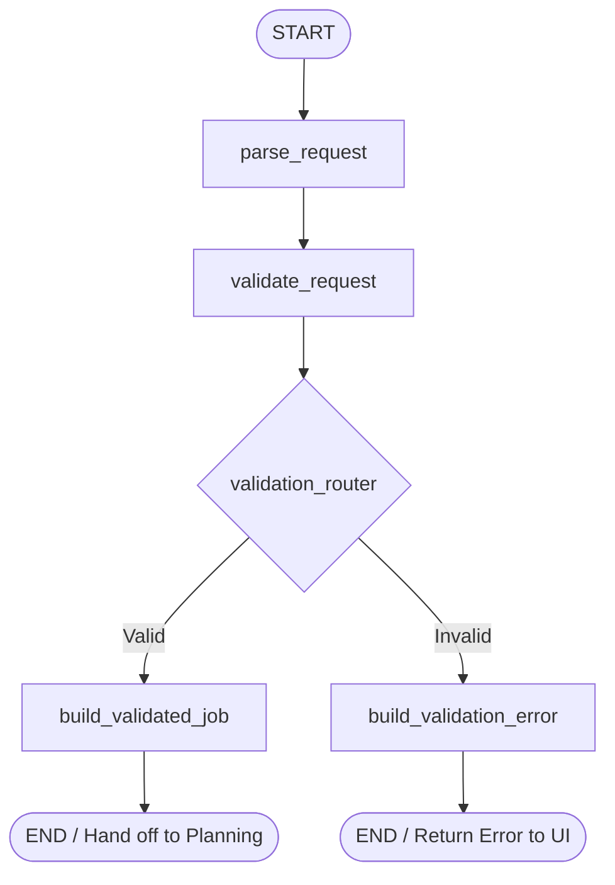

# Intake Agent Specification & Workflow

The **Intake Agent** is an automated validation and normalization pipeline built with **LangGraph** (`StateGraph`). It processes customer service requests submitted via the Customer Portal or API, performs deterministic intent and skill validation, and outputs a structured validated job requirement for the Planning Agent.

---

## 1. Workflow Architecture (LangGraph)

The Intake Agent operates as a directed acyclic graph with conditional routing:



### Graph Nodes

1. **`parse_request`**:
   - Ingests raw customer request payload.
   - Extracts and sanitizes: `service`, `title`, `description`, `location`, `priority`, `site_latitude`, `site_longitude`, `contact_number`, `preferred_visit_date`.
   - Normalizes coordinates embedded in strings (e.g. `"13.0827, 80.2707"`).

2. **`validate_request`**:
   - Evaluates request against business rules.
   - Distinguishes between **VALID**, **MISMATCH**, and **UNCLEAR**.
   - Populates `validation_errors` list with structured details.

3. **`validation_router`**:
   - Conditional edge router.
   - If `valid is True` $\rightarrow$ routes to `build_validated_job`.
   - If `valid is False` $\rightarrow$ routes to `build_validation_error`.

4. **`build_validation_error`**:
   - Formats customer-facing error response with specific failure reasons.
   - Prevents downstream planning execution.

5. **`build_validated_job`**:
   - Maps requested service to canonical skill using `map_service_type_to_skill()`.
   - Produces immutable `ValidatedJobRequirement` payload.

---

## 2. Validation Rules & Categories

### Category 1: VALID
The customer-selected service matches the service detected from the natural-language title/description.

- **Example**:
  - **Selected**: `Electrical`
  - **Description**: `"I need an electrician to repair a wiring issue in my kitchen."`
  - **Result**: `valid = True`
  - **Action**: Proceeds to Planning Agent.

### Category 2: MISMATCH
The customer-selected service, title, and description must **all match the same service category**. If any conflict exists between the title, description, or selected service, a specific mismatch error is returned.

- **Example A (Selected vs Request Mismatch - Image 1)**:
  - **Title**: `"air conditionar is not working properly"`
  - **Description**: `"air conditionar is not working properly come and check"`
  - **Selected**: `Plumbing`
  - **Result**: `valid = False`
  - **Error Type**: `"mismatch"`
  - **Field**: `"service"`
  - **Message**:
    ```text
    "Your request describes a HVAC-related problem, but you selected Plumbing. Please select the appropriate Service Type."
    ```
  - **Action**: Returns HTTP 400 with structured error. **Planning Agent is NOT called.**

- **Example B (Title vs Description Conflict)**:
  - **Title**: `"Ac repair"` (HVAC)
  - **Description**: `"water is leaking from the kitchen sink"` (Plumbing)
  - **Selected**: `Plumbing`
  - **Result**: `valid = False`
  - **Error Type**: `"mismatch"`
  - **Field**: `"service"`
  - **Message**:
    ```text
    "Your request describes a Plumbing-related problem, but title indicates HVAC while description indicates Plumbing. Title, description, and selected service must all match. Please select the appropriate Service Type."
    ```
  - **Action**: Returns HTTP 400. **Submission blocked.**

### Category 3: UNCLEAR
The request does not contain enough information to identify the required service (e.g. gibberish, vague text like "I need help"), or mandatory information (such as location) is missing.

- **Example A (Gibberish / Vague Request - Image 2)**:
  - **Title**: `"hdjabfksnksviowjgvihniien uiiufofhiowjfioemkfnrfewmflwejiw"`
  - **Description**: `"hdjabfksnksviowjgvihniien uiiufofhiowjfioemkfnrfewmflwejiwhdfejoqji32"`
  - **Selected**: `Network Support`
  - **Result**: `valid = False`
  - **Error Type**: `"unclear"`
  - **Field**: `"service"`
  - **Message**:
    ```text
    "The problem could not be understood clearly. Please provide more specific details about the problem and select the appropriate Service Type."
    ```

- **Example B (Generic Help)**:
  - **Title**: `"Help"`
  - **Description**: `"I need help."`
  - **Result**: `valid = False`
  - **Error Type**: `"unclear"`
  - **Field**: `"service"`
  - **Message**:
    ```text
    "The problem could not be understood clearly. Please provide more specific details about the problem and select the appropriate Service Type."
    ```

- **Example C (Missing Location)**:
  - **Location**: `""`
  - **Result**: `valid = False`
  - **Error Type**: `"unclear"`
  - **Field**: `"location"`
  - **Message**:
    ```text
    "Customer location is required to find the nearest eligible technicians."
    ```

---

## 3. Schemas & Data Contracts

### Validation Error Response Schema (`ValidationErrorDetail`)
```json
{
  "valid": false,
  "error_type": "mismatch",
  "field": "service",
  "message": "Selected service is Electrical, but the request appears to require Plumbing.",
  "detected_value": "Plumbing",
  "expected_value": "Electrical"
}
```

### Validated Job Output Schema (`ValidatedJobRequirement`)
```json
{
  "valid": true,
  "job_requirement": {
    "service": "Electrical",
    "required_skill": "Electrical",
    "location": "Anna Nagar, Chennai",
    "priority": "HIGH",
    "title": "Wiring issue",
    "description": "I need an electrician to repair a wiring issue in my home office.",
    "site_latitude": 13.0827,
    "site_longitude": 80.2707,
    "contact_number": "9876543210",
    "customer_name": "John Doe",
    "preferred_visit_date": "2026-10-15"
  }
}
```

---

## 4. Terminal Logging Specification

On every run, the Intake Agent emits clean ASCII-formatted logging:

```text
==================================================
INTAKE AGENT
============

INPUT:
{
  "service": "Electrical",
  "title": "Wiring issue",
  "description": "I need an electrician to repair a wiring issue in my home office.",
  "location": "Anna Nagar, Chennai",
  "priority": "HIGH"
}

OUTPUT:
{
  "valid": true,
  "job_requirement": {
    "service": "Electrical",
    "required_skill": "Electrical",
    "location": "Anna Nagar, Chennai",
    "priority": "HIGH",
    "title": "Wiring issue",
    "description": "I need an electrician to repair a wiring issue in my home office.",
    "site_latitude": 13.0827,
    "site_longitude": 80.2707,
    "contact_number": "",
    "customer_name": "Customer",
    "preferred_visit_date": null
  }
}
```

---

## 5. UI Correction Loop

When Intake validation fails:
1. Customer submits request via Customer Portal.
2. Intake Agent intercepts and detects mismatch or unclear details.
3. Backend returns `HTTP 400 Bad Request` with `detail: { valid: false, error_type: ..., message: ... }`.
4. Portal UI displays the exact professional error message in the alert banner.
5. Planning Agent does **NOT** run.
6. Customer modifies input (e.g. changes service dropdown or clarifies description) and resubmits.
7. Intake Agent re-validates and proceeds once valid.

