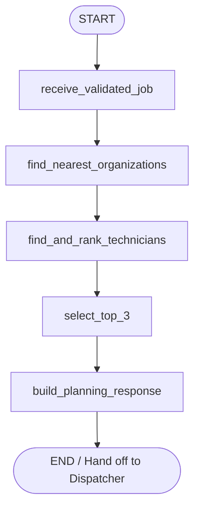

# Planning Agent Specification & Workflow

The **Planning Agent** is an automated scheduling and technician recommendation engine built with **LangGraph** (`StateGraph`). It receives **ONLY** the validated job requirement produced by the Intake Agent, locates capable service organizations, verifies technician workload and availability, and performs deterministic multi-tier proximity ranking to produce the **TOP 3 technicians** for dispatch.

---

## 1. Workflow Architecture (LangGraph)

The Planning Agent executes a sequential, deterministic pipeline:



### Graph Nodes

1. **`receive_validated_job`**:
   - Ingests **ONLY** the `ValidatedJobRequirement` from the Intake Agent.
   - Extracts job coordinates `(site_latitude, site_longitude)` or geocodes address.
   - Initializes evaluation state.

2. **`find_nearest_organizations`**:
   - Queries active organizations with valid geographical coordinates.
   - Filters organizations that possess technicians capable of handling the required skill AND having available capacity (`workload < 5`).
   - Computes Haversine distance from customer to organization coordinates.
   - Sorts organizations in ascending order of proximity.

3. **`find_and_rank_technicians`**:
   - Iterates through organizations in order of proximity (nearest first).
   - Evaluates technicians within each organization against eligibility criteria.
   - Applies **Same-Organization-First** ranking: sorts eligible technicians within the organization by their distance to the customer before advancing to the next organization.

4. **`select_top_3`**:
   - Extracts the top 3 technicians from the complete ranked candidate list (`candidates[:3]`).
   - If fewer than 3 technicians are eligible (e.g. 1 or 2), returns all available eligible technicians without fabricating dummy data.

5. **`build_planning_response`**:
   - Compiles final payload containing `job_id`, `total_eligible_technicians`, and `top_3_technicians`.

---

## 2. Eligibility Rules

A technician is deemed **eligible** if and only if all three conditions are satisfied:

1. **Skill Match**:
   - Technician possesses the skill required for the job using canonical mapping (`is_skill_matching`).
2. **Organization Capability**:
   - Technician belongs to an active organization with valid site coordinates capable of handling the service.
3. **Strict Workload Boundary (`workload < 5`)**:
   - Technician's active job count (`current_jobs`) must be **strictly less than 5**.

| Workload (`current_jobs`) | Status | Eligible? |
|:---:|:---:|:---:|
| **0** | Available | **YES** |
| **1** | Available | **YES** |
| **2** | Available | **YES** |
| **3** | Available | **YES** |
| **4** | Available | **YES** |
| **5** | Max Capacity | **NO (Ineligible)** |
| **> 5** | Overloaded | **NO (Ineligible)** |

> [!IMPORTANT]
> The threshold is strictly `< 5`, never `<= 5`. Technicians with 5 or more jobs are excluded from evaluation.

---

## 3. Organization + Technician Ranking Algorithm

Ranking is strictly deterministic and follows a three-step hierarchy:

### Step 1: Nearest Eligible Organization
Find the nearest organization to the customer that has eligible technicians (`workload < 5` and matching skill). Take eligible technicians from that organization first.

### Step 2: Same Organization First
If the nearest organization has multiple eligible technicians, **all eligible technicians from that organization must be ranked before moving to another organization**. Within that organization, technicians are sorted in ascending order of their distance to the customer.

### Step 3: Next Nearest Organization
If the nearest organization does not have enough eligible technicians to satisfy the TOP 3 requirement, proceed to the next nearest eligible organization in ascending distance order.

### Example Walkthrough

- Customer Location: Chennai
- **Org A (Distance to customer: 2.0 km)**:
  - Tech A1: 2.1 km, Workload 2 $\rightarrow$ Eligible
  - Tech A2: 4.3 km, Workload 1 $\rightarrow$ Eligible
  - Tech A3: Workload 5 $\rightarrow$ **Ineligible**
- **Org B (Distance to customer: 3.5 km)**:
  - Tech B1: 3.0 km, Workload 0 $\rightarrow$ Eligible
  - Tech B2: 6.8 km, Workload 3 $\rightarrow$ Eligible

**Final Ranking Order**:
1. **Rank 1**: Tech A1 (Org A, 2.1 km)
2. **Rank 2**: Tech A2 (Org A, 4.3 km)  *(Same organization priority: ranked before Tech B1 despite B1 being closer at 3.0 km)*
3. **Rank 3**: Tech B1 (Org B, 3.0 km)

---

## 4. Dispatcher TOP 3 Contract & Single Technician Handling

The response delivered to the Dispatcher contains:
- `total_eligible_technicians`: Total count of all eligible technicians evaluated across all organizations.
- `top_3_technicians`: List of up to 3 ranked technicians.

### Scenario A: Normal Pool (3 or more eligible)
```json
{
  "job_id": 144,
  "total_eligible_technicians": 7,
  "top_3": [
    {
      "technician_id": 21,
      "rank": 1,
      "confidence": 1.0,
      "estimated_eta": 15,
      "organization_id": "org-292ccd5acf7f",
      "organization_name": "Kiruba",
      "organization_distance": 1.9328618033175604,
      "technician_distance": 6.641944366650744,
      "technician_name": "melvin new",
      "workload": 1,
      "distance_km": 6.64
    },
    {
      "technician_id": 19,
      "rank": 2,
      "confidence": 1.0,
      "estimated_eta": 8,
      "organization_id": "org-76d2f14718b8",
      "organization_name": "org C",
      "organization_distance": 2.1141874057381376,
      "technician_distance": 0.9673290625136668,
      "technician_name": "cdisnot one",
      "workload": 0,
      "distance_km": 0.97
    },
    {
      "technician_id": 16,
      "rank": 3,
      "confidence": 1.0,
      "estimated_eta": 22,
      "organization_id": "org-kevin",
      "organization_name": "kevin & co",
      "organization_distance": 5.651845091732159,
      "technician_distance": 10.555027177626743,
      "technician_name": "Karthik S",
      "workload": 2,
      "distance_km": 10.56
    }
  ]
}
```

### Scenario B: Single Eligible Technician
If only 1 technician is eligible across all organizations:
- `total_eligible_technicians`: `1`
- `top_3`: Contains only that 1 technician with `rank: 1`.
- **No dummy or fabricated technicians are ever returned.**

```json
{
  "job_id": 145,
  "total_eligible_technicians": 1,
  "top_3": [
    {
      "technician_id": 21,
      "rank": 1,
      "confidence": 1.0,
      "estimated_eta": 15,
      "organization_id": "org-292ccd5acf7f",
      "organization_name": "Kiruba",
      "organization_distance": 1.9328618033175604,
      "technician_distance": 6.641944366650744,
      "technician_name": "melvin new",
      "workload": 1,
      "distance_km": 6.64
    }
  ]
}
```

---

## 5. Terminal Logging Specification

On every run, the Planning Agent emits clean ASCII-formatted logging matching the project specification:

```text
==================================================
PLANNING AGENT
==============

INPUT:
{
  "service": "HVAC",
  "required_skill": "HVAC",
  "location": "Ward 132, Kodambakkam, Chennai",
  "priority": "HIGH",
  "title": "ac repair in house",
  "description": "ac is not cooling properly kindly come and fix it",
  "job_id": 144
}

OUTPUT:
{
  "job_id": 144,
  "total_eligible_technicians": 3,
  "top_3": [
    {
      "technician_id": 21,
      "rank": 1,
      "confidence": 1.0,
      "estimated_eta": 15,
      "organization_id": "org-292ccd5acf7f",
      "organization_name": "Kiruba",
      "organization_distance": 1.9328618033175604,
      "technician_distance": 6.641944366650744,
      "technician_name": "melvin new",
      "workload": 1
    }
  ]
}

==================================================
PLANNING TOP 3
==============

Rank 1:
Technician: melvin new
Organization: Kiruba (ID: org-292ccd5acf7f)
Organization Distance: 1.9328618033175604 km
Technician Distance: 6.641944366650744 km
Confidence: 1.0
Estimated ETA: 15 mins
Workload: 1

==================================================
```

---

## 6. API Integration

### 1. Customer Portal Submission
- **Route**: `POST /customer-portal/service-requests`
- Automatically executes Intake $\rightarrow$ Planning LangGraph workflow.
- On Intake error: returns `400 Bad Request` with structured error.
- On success: returns `201 Created` with created service request, created job, `total_eligible_technicians`, and `top_3_technicians`.

### 2. Direct Dispatcher Auto-Plan Endpoint
- **Route**: `POST /planning/workflow/auto-plan`
- Requires: `PLANNING_VIEW` permission (Dispatcher, Admin).
- Executes workflow directly for testing or manual planning triggers.
- Body:
  ```json
  {
    "service": "Electrical",
    "title": "Short circuit repair",
    "description": "Need an electrician to fix wiring.",
    "location": "13.0827, 80.2707",
    "priority": "HIGH"
  }
  ```

